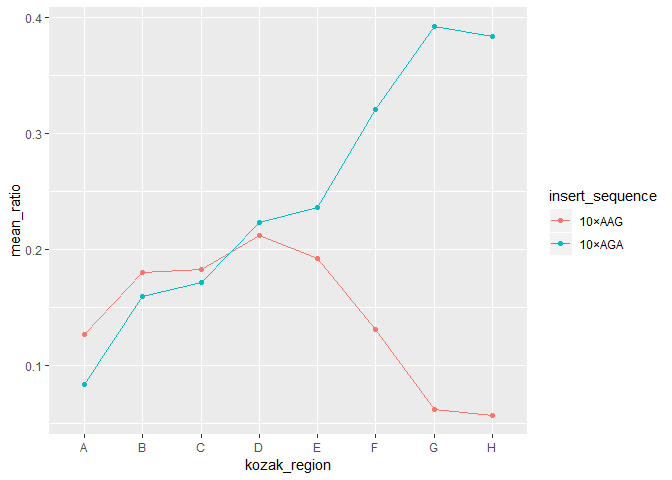

tfcb-homework2-analysis
================

``` r
# Access tidyverse library
library(tidyverse)
```

    ## -- Attaching packages ------------------------------------------------------------------------------------------------------------------------- tidyverse 1.2.1 --

    ## v ggplot2 3.0.0     v purrr   0.2.5
    ## v tibble  1.4.2     v dplyr   0.7.6
    ## v tidyr   0.8.1     v stringr 1.3.1
    ## v readr   1.1.1     v forcats 0.3.0

    ## -- Conflicts ---------------------------------------------------------------------------------------------------------------------------- tidyverse_conflicts() --
    ## x dplyr::filter() masks stats::filter()
    ## x dplyr::lag()    masks stats::lag()

``` r
# Load data file into tibble
data <- read_tsv("../data/example_dataset_2.tsv") %>%
  
  # Add a column that provides mean ratio
  mutate(mean_ratio = mean_yfp / mean_rfp) %>%

  # Round the new column's value to the hundredths-place
  mutate(mean_ratio = round(mean_ratio, 2)) %>%
  
  # Print modified table
  print()
```

    ## Parsed with column specification:
    ## cols(
    ##   strain = col_character(),
    ##   mean_yfp = col_integer(),
    ##   mean_rfp = col_integer()
    ## )

    ## # A tibble: 16 x 4
    ##    strain  mean_yfp mean_rfp mean_ratio
    ##    <chr>      <int>    <int>      <dbl>
    ##  1 schp688     1748    20754       0.08
    ##  2 schp684     3294    20585       0.16
    ##  3 schp690     3535    20593       0.17
    ##  4 schp687     4658    20860       0.22
    ##  5 schp686     5000    21171       0.24
    ##  6 schp685     7379    22956       0.32
    ##  7 schp683     9365    23866       0.39
    ##  8 schp689     8693    22649       0.38
    ##  9 schp679     2528    19906       0.13
    ## 10 schp675     3687    20438       0.18
    ## 11 schp681     3705    20227       0.18
    ## 12 schp678     4378    20630       0.21
    ## 13 schp677     3967    20604       0.19
    ## 14 schp676     2657    20223       0.13
    ## 15 schp674     1270    20316       0.06
    ## 16 schp680     1117    19377       0.06

``` r
# Load annotations file into a tibble
annotations <- read_tsv("../data/example_dataset_3.tsv") %>%
  print()
```

    ## Parsed with column specification:
    ## cols(
    ##   strain = col_character(),
    ##   insert_sequence = col_character(),
    ##   kozak_region = col_character()
    ## )

    ## # A tibble: 17 x 3
    ##    strain  insert_sequence kozak_region
    ##    <chr>   <chr>           <chr>       
    ##  1 schp674 10×AAG          G           
    ##  2 schp675 10×AAG          B           
    ##  3 schp676 10×AAG          F           
    ##  4 schp677 10×AAG          E           
    ##  5 schp678 10×AAG          D           
    ##  6 schp679 10×AAG          A           
    ##  7 schp680 10×AAG          H           
    ##  8 schp681 10×AAG          C           
    ##  9 schp683 10×AGA          G           
    ## 10 schp684 10×AGA          B           
    ## 11 schp685 10×AGA          F           
    ## 12 schp686 10×AGA          E           
    ## 13 schp687 10×AGA          D           
    ## 14 schp688 10×AGA          A           
    ## 15 schp689 10×AGA          H           
    ## 16 schp690 10×AGA          C           
    ## 17 control <NA>            <NA>

``` r
# Join 'data' and 'annotations' tables by their in-common 'strain' name
data %>%
  inner_join(annotations, by = "strain") %>%
  print()
```

    ## # A tibble: 16 x 6
    ##    strain  mean_yfp mean_rfp mean_ratio insert_sequence kozak_region
    ##    <chr>      <int>    <int>      <dbl> <chr>           <chr>       
    ##  1 schp688     1748    20754       0.08 10×AGA          A           
    ##  2 schp684     3294    20585       0.16 10×AGA          B           
    ##  3 schp690     3535    20593       0.17 10×AGA          C           
    ##  4 schp687     4658    20860       0.22 10×AGA          D           
    ##  5 schp686     5000    21171       0.24 10×AGA          E           
    ##  6 schp685     7379    22956       0.32 10×AGA          F           
    ##  7 schp683     9365    23866       0.39 10×AGA          G           
    ##  8 schp689     8693    22649       0.38 10×AGA          H           
    ##  9 schp679     2528    19906       0.13 10×AAG          A           
    ## 10 schp675     3687    20438       0.18 10×AAG          B           
    ## 11 schp681     3705    20227       0.18 10×AAG          C           
    ## 12 schp678     4378    20630       0.21 10×AAG          D           
    ## 13 schp677     3967    20604       0.19 10×AAG          E           
    ## 14 schp676     2657    20223       0.13 10×AAG          F           
    ## 15 schp674     1270    20316       0.06 10×AAG          G           
    ## 16 schp680     1117    19377       0.06 10×AAG          H

``` r
# Join 'data' and 'annotations' tables, keeping 'data' rows
data %>%
  left_join(annotations, by = "strain") %>%
  print()
```

    ## # A tibble: 16 x 6
    ##    strain  mean_yfp mean_rfp mean_ratio insert_sequence kozak_region
    ##    <chr>      <int>    <int>      <dbl> <chr>           <chr>       
    ##  1 schp688     1748    20754       0.08 10×AGA          A           
    ##  2 schp684     3294    20585       0.16 10×AGA          B           
    ##  3 schp690     3535    20593       0.17 10×AGA          C           
    ##  4 schp687     4658    20860       0.22 10×AGA          D           
    ##  5 schp686     5000    21171       0.24 10×AGA          E           
    ##  6 schp685     7379    22956       0.32 10×AGA          F           
    ##  7 schp683     9365    23866       0.39 10×AGA          G           
    ##  8 schp689     8693    22649       0.38 10×AGA          H           
    ##  9 schp679     2528    19906       0.13 10×AAG          A           
    ## 10 schp675     3687    20438       0.18 10×AAG          B           
    ## 11 schp681     3705    20227       0.18 10×AAG          C           
    ## 12 schp678     4378    20630       0.21 10×AAG          D           
    ## 13 schp677     3967    20604       0.19 10×AAG          E           
    ## 14 schp676     2657    20223       0.13 10×AAG          F           
    ## 15 schp674     1270    20316       0.06 10×AAG          G           
    ## 16 schp680     1117    19377       0.06 10×AAG          H

``` r
# Join 'data' and 'annotations' tables, keeping 'annotations' rows
data %>%
  right_join(annotations, by = "strain") %>%
  print()
```

    ## # A tibble: 17 x 6
    ##    strain  mean_yfp mean_rfp mean_ratio insert_sequence kozak_region
    ##    <chr>      <int>    <int>      <dbl> <chr>           <chr>       
    ##  1 schp674     1270    20316       0.06 10×AAG          G           
    ##  2 schp675     3687    20438       0.18 10×AAG          B           
    ##  3 schp676     2657    20223       0.13 10×AAG          F           
    ##  4 schp677     3967    20604       0.19 10×AAG          E           
    ##  5 schp678     4378    20630       0.21 10×AAG          D           
    ##  6 schp679     2528    19906       0.13 10×AAG          A           
    ##  7 schp680     1117    19377       0.06 10×AAG          H           
    ##  8 schp681     3705    20227       0.18 10×AAG          C           
    ##  9 schp683     9365    23866       0.39 10×AGA          G           
    ## 10 schp684     3294    20585       0.16 10×AGA          B           
    ## 11 schp685     7379    22956       0.32 10×AGA          F           
    ## 12 schp686     5000    21171       0.24 10×AGA          E           
    ## 13 schp687     4658    20860       0.22 10×AGA          D           
    ## 14 schp688     1748    20754       0.08 10×AGA          A           
    ## 15 schp689     8693    22649       0.38 10×AGA          H           
    ## 16 schp690     3535    20593       0.17 10×AGA          C           
    ## 17 control       NA       NA      NA    <NA>            <NA>

``` r
# Summarize yfp and rfp means across rows
data %>% 
  summarize(max_yfp = max(mean_yfp),
            max_rfp = max(mean_rfp)) %>%
  print()
```

    ## # A tibble: 1 x 2
    ##   max_yfp max_rfp
    ##     <dbl>   <dbl>
    ## 1    9365   23866

``` r
# Load data file nito a tibble
data_2 <- read_tsv("../data/example_dataset_4.tsv") %>%
  print()
```

    ## Parsed with column specification:
    ## cols(
    ##   strain = col_character(),
    ##   yfp = col_integer(),
    ##   rfp = col_integer(),
    ##   replicate = col_integer()
    ## )

    ## # A tibble: 74 x 4
    ##    strain    yfp   rfp replicate
    ##    <chr>   <int> <int>     <int>
    ##  1 schp677  4123 20661         1
    ##  2 schp678  4550 21437         1
    ##  3 schp675  3880 21323         1
    ##  4 schp676  2863 20668         1
    ##  5 schp687  4767 20995         1
    ##  6 schp688  1274 20927         1
    ##  7 schp679  2605 20840         1
    ##  8 schp680  1175 20902         1
    ##  9 schp681  3861 20659         1
    ## 10 schp683  9949 25406         1
    ## # ... with 64 more rows

``` r
# Group rows by common 'strain' names
data_2 %>%
  group_by(strain) %>%
  
  # Summarize each group's mean fluorescence
  summarize(mean_yfp = mean(yfp),
            mean_rfp = mean(rfp),
            
            # Calculate esach group's standard error
            se_yfp = sd(yfp) / sqrt(n()),
            se_rfp = sd(rfp) / sqrt(n())) %>%
  
  # Add column for mean ratio of yfp to rfp
  mutate(mean_ratio = mean_yfp / mean_rfp) %>%
           
  # Join annotations with modified dataset by common strain names
  left_join(annotations, by = "strain") %>%
  
  # Make line/point plot of mean fluorescence ration vs kozak region
  ggplot(aes(x = kozak_region, 
            y = mean_ratio,
            
            # Rows with different insert sequences get different colors
            color = insert_sequence,
            group = insert_sequence)) +
  geom_line() +
  geom_point()
```


